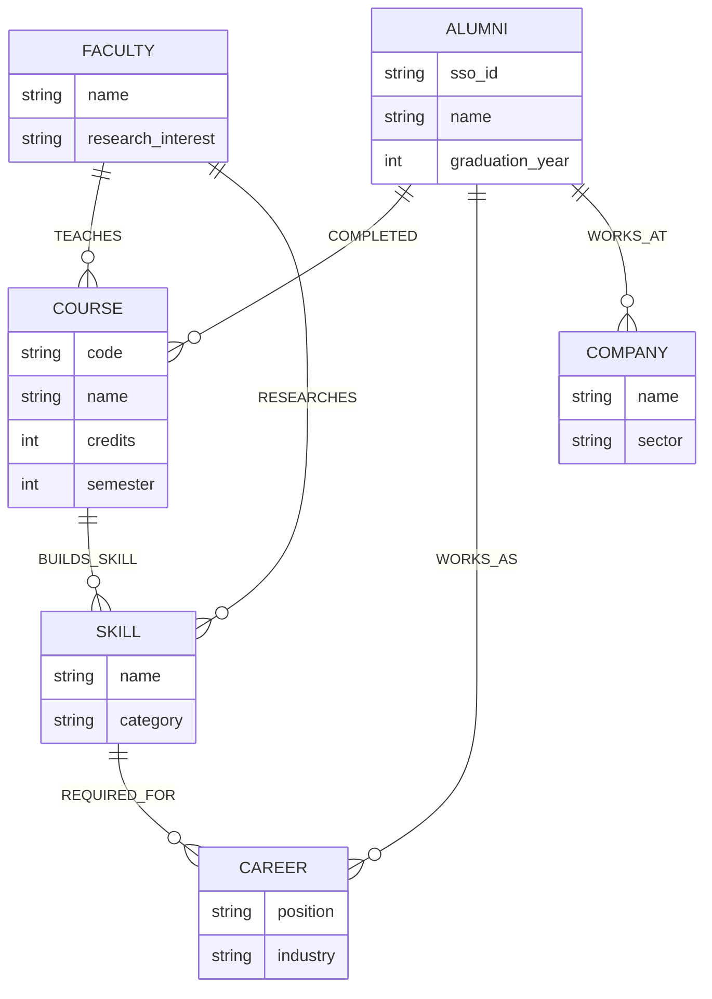

# EduGraph Data Model

Proyek EduGraph menggunakan **Neo4j Graph Database**. Berbeda dengan database relasional (SQL) yang menggunakan tabel, model data kami direpresentasikan dalam bentuk entitas (*Nodes*) dan relasi (*Relationships*).

## Graph Entity-Relationship Diagram

## Deskripsi Entitas (Nodes)
1. **Course (Mata Kuliah):** Merepresentasikan kelas yang diambil oleh mahasiswa di fakultas.
2. **Skill (Keahlian):** Kemampuan teknis atau soft skill yang diperoleh dari mata kuliah atau riset.
3. **Career (Karier):** Posisi pekerjaan atau profil profesional di industri.
4. **Faculty (Dosen):** Tenaga pengajar dan peneliti di lingkungan kampus.
5. **Alumni/User:** Lulusan atau mahasiswa aktif yang menempuh jalur akademik tertentu.
6. **Company (Perusahaan):** Tempat di mana alumni bekerja.

## Deskripsi Relasi (Edges)
* `[:BUILDS_SKILL]` -> Menghubungkan Mata Kuliah dengan Keahlian yang diajarkan di dalamnya.
* `[:REQUIRED_FOR]` -> Menghubungkan Keahlian dengan posisi Karier di industri yang mensyaratkan keahlian tersebut.
* `[:TEACHES]` -> Menghubungkan Dosen dengan Mata Kuliah yang diampunya.
* `[:RESEARCHES]` -> Menghubungkan Dosen dengan Keahlian/Topik Riset yang menjadi fokusnya.
* `[:COMPLETED]` -> Menghubungkan Alumni/User dengan Mata Kuliah yang telah diselesaikan.
* `[:WORKS_AS]` -> Menghubungkan Alumni/User dengan posisi Karier mereka saat ini.
* `[:WORKS_AT]` -> Menghubungkan Alumni/User dengan Perusahaan tempat mereka bekerja.
